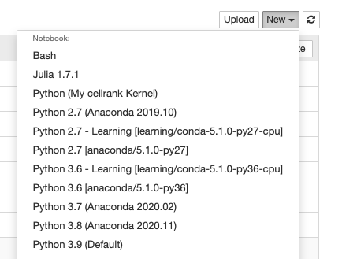
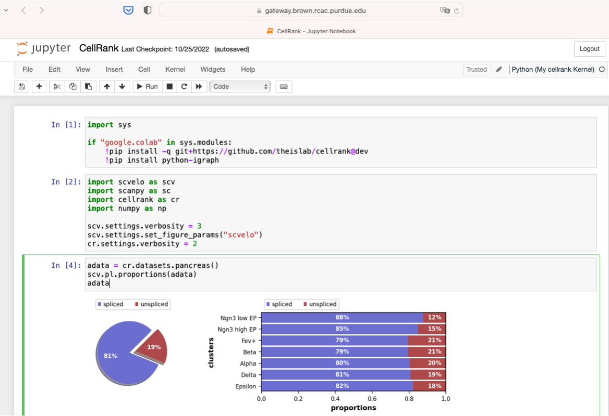

Jupyter kernel creation
==============================
JupyterLab is the latest web-based interactive development environment for notebooks, code, and data. Its flexible interface allows users to configure and arrange workflows in data science, scientific computing, computational journalism, and machine learning. The Jupyter Notebook is the original web application for creating and sharing computational documents.

Both JupyterLab and Jupyter Notebook are supported on Open OnDemand of RCAC clusters. This tutorial will introduce how to create a personal kernal using the terminal, then run python codes on Open OnDemand Jupyter with the newly created kernel.

To facilitate the process, we provide a script ``conda-env-mod`` that generates a module file for an environment, as well as an optional Jupyter kernel to use this environment in Jupyter.

Step1: Load the anaconda module
~~~~~~~~~~~~~~~~~~~~~~~~~~~~~~~
You must load one of the anaconda modules in order to use this script::
         
        module spider anaconda
        module load anaconda/xxxx    ## choose the anaconda and python version you want to use

Step 2: Create a conda environment
~~~~~~~~~~~~~~~~~~~~~~~~~~~~~~~~~~~
By default, ``conda-env-mod`` will only create the environment and a module file(no Jupyter kernel). If you plan to use your environment in a Jupyter, you need to append a ``--jupyter`` flag::

        conda-env-mod create -n mypackages --jupyter

Step 3: Load the conda environment
~~~~~~~~~~~~~~~~~~~~~~~~~~~~~~~~~~~
The following instructions assume that you have used ``conda-env-mod`` script to create an environment named ``mypackages``::
        
        module load use.own
        module load conda-env/mypackages-py3.8.5 # py3.8.5 is associated with the python in the loaded anaconda module.

Step 4: Install packages
~~~~~~~~~~~~~~~~~~~~~~~~~~~~~~~~~~
Now you can install custom packages in the environment using either ``conda install`` or ``pip install``::
        
        conda install Package1
        pip install Package2

Step 5: Open OnDemand Jupyter
~~~~~~~~~~~~~~~~~~~~~~~~~~~~~~~~~~~~~~~~~~~~~~~~~~~~~~~~~~~~~~~~~~~~~~~~~~~~~~~~
In Jupyter Lab or Jupter Notebook of Open OnDemand, you can create a new notebook with the newly created kernel.

Example: CellRank
~~~~~~~~~~~~~~~~~~
CellRank is a toolkit to uncover cellular dynamics based on Markov state modeling of single-cell data (https://github.com/theislab/cellrank).

Create a conda environment with Jupyter kernel::

        module load anaconda/2020.11-py38
        conda-env-mod create -n cellrank --jupyter

Next we can load the module, and install CellRank::

        module load use.own 
        module load conda-env/cellrank-py3.8.5
        conda install -c conda-forge -c bioconda cellrank

Select the newly created kernel ``Python(My cellrank Kernel)`` in Jupyter Notbook or Jupyter Lab. 

Now we can use ``Python(My cellrank Kernel)`` to run scRNAseq analysis. 

