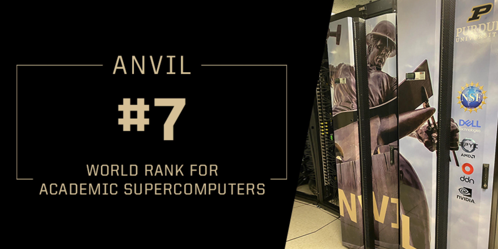
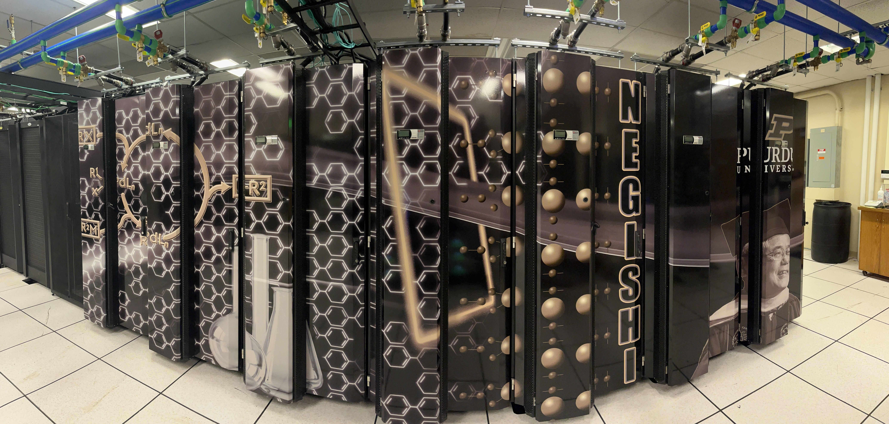

Scientific Applications on Purdue RCAC Clusters and ACCESS Anvil
==============================================

|Anvil| |Negishi|

This is the list of Applications, Compilers, MPIs, NVIDIA NGC containers, and AMD ROCm containers deployed on Rosen Center for Advanced Computing (`RCAC`_) clusters (`Negishi`_, `Bell`_, `Gilbreth`_, `Brown`_, `Scholar`_, and `Workbench`_) and ACCESS `Anvil`_.

.. _Negishi: https://www.rcac.purdue.edu/compute/negishi
.. _Bell: https://www.rcac.purdue.edu/compute/bell
.. _Brown: https://www.rcac.purdue.edu/compute/brown
.. _Gilbreth: https://www.rcac.purdue.edu/compute/gilbreth
.. _Scholar: https://www.rcac.purdue.edu/compute/scholar
.. _Workbench: https://www.rcac.purdue.edu/compute/workbench
.. _Anvil: https://www.rcac.purdue.edu/anvil
.. _RCAC: https://www.rcac.purdue.edu
.. _Biocontainers: https://biocontainer-doc.readthedocs.io/en/latest/

.. toctree::
   :maxdepth: 2

   FAQs
   Compilers
   MPIs
   Applications
   Utilities
   Biocontainers
   NGC
   ROCm
