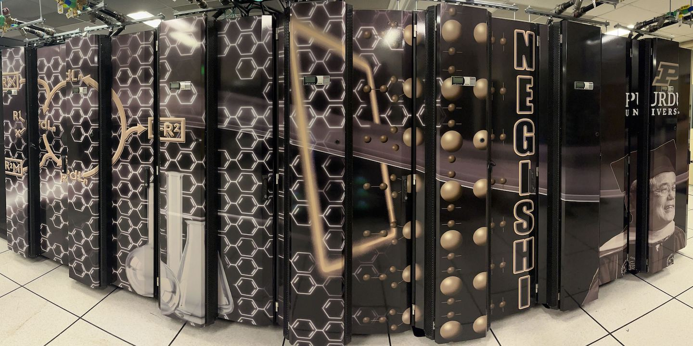

Scientific Applications on Purdue RCAC Clusters and ACCESS Anvil
==============================================
.. |Anvil| image:: images/anvil.jpg
   :width: 49%

|Anvil| |Negishi|

This is the list of Applications, Compilers, MPIs, NVIDIA NGC containers, and AMD ROCm containers deployed on Rosen Center for Advanced Computing (`RCAC`_) clusters (`Negishi`_, `Bell`_, `Gilbreth`_, `Brown`_, `Scholar`_, and `Workbench`_) and ACCESS `Anvil`_. If you want to know what bioinformatics applications are deployed on clusters, please check our `Biocontainers`_ documentation. 

.. _Negishi: https://www.rcac.purdue.edu/compute/negishi
.. _Bell: https://www.rcac.purdue.edu/compute/bell
.. _Brown: https://www.rcac.purdue.edu/compute/brown
.. _Gilbreth: https://www.rcac.purdue.edu/compute/gilbreth
.. _Scholar: https://www.rcac.purdue.edu/compute/scholar
.. _Workbench: https://www.rcac.purdue.edu/compute/workbench
.. _Anvil: https://www.rcac.purdue.edu/anvil
.. _RCAC: https://www.rcac.purdue.edu
.. _Biocontainers: https://biocontainer-doc.readthedocs.io/en/latest/

.. toctree::
   :caption: FAQs
   :titlesonly:
   
   FAQs/AMDgpu
   FAQs/GPUconstraints
   FAQs/hypershell
   FAQs/julia_package
   FAQs/jupyter_kernels
   FAQs/MPI
   FAQs/R

.. toctree::
   :caption: Compilers
   :titlesonly:
   
   Compilers/aocc
   Compilers/gcc
   Compilers/intel-oneapi-compilers
   Compilers/intel

.. toctree::
   :caption: MPIs
   :titlesonly:
   
   MPIs/impi
   MPIs/intel-oneapi-mpi
   MPIs/mvapich2
   MPIs/openmpi

.. toctree::
   :caption: Applications
   :titlesonly:
   
   Applications/abaqus
   Applications/amber
   Applications/amdblis
   Applications/amdfftw
   Applications/amdlibflame
   Applications/amdlibm
   Applications/amdscalapack
   Applications/anaconda
   Applications/ansysem
   Applications/ansys
   Applications/aocl
   Applications/arpack-ng
   Applications/aws-cli
   Applications/bamtools
   Applications/bbftp
   Applications/beagle
   Applications/beast2
   Applications/bismark
   Applications/blast-plus
   Applications/blis
   Applications/boost
   Applications/bowtie2
   Applications/bwa
   Applications/bzip2
   Applications/caffe
   Applications/cdo
   Applications/cmake
   Applications/cntk
   Applications/comsol
   Applications/cp2k
   Applications/cplex
   Applications/cuda
   Applications/cudnn
   Applications/cue-login-env
   Applications/cufflinks
   Applications/curl
   Applications/cutadapt
   Applications/eigen
   Applications/emacs
   Applications/envi
   Applications/fastqc
   Applications/fasttree
   Applications/fastx-toolkit
   Applications/ffmpeg
   Applications/fftw
   Applications/gamess
   Applications/gams
   Applications/gatk
   Applications/gaussian09
   Applications/gaussian16
   Applications/gaussview
   Applications/gdal
   Applications/gdb
   Applications/geos
   Applications/gmp
   Applications/gmt
   Applications/gnuplot
   Applications/gpaw
   Applications/grads
   Applications/gromacs
   Applications/gsl
   Applications/gurobi
   Applications/gym
   Applications/hadoop
   Applications/hdf5
   Applications/hdf
   Applications/hpctoolkit
   Applications/hspice
   Applications/htseq
   Applications/hwloc
   Applications/hyper-shell
   Applications/hypre
   Applications/idl
   Applications/intel-mkl
   Applications/intel-oneapi-mkl
   Applications/intel-oneapi-tbb
   Applications/julia
   Applications/jupyterhub
   Applications/jupyter
   Applications/keras
   Applications/lammps
   Applications/launcher
   Applications/learning
   Applications/libfabric
   Applications/libflame
   Applications/libiconv
   Applications/libmesh
   Applications/libszip
   Applications/libtiff
   Applications/libv8
   Applications/libx11
   Applications/libxml2
   Applications/mathematica
   Applications/matlab
   Applications/meep
   Applications/modtree
   Applications/monitor
   Applications/mpc
   Applications/mpfr
   Applications/mrbayes
   Applications/mxnet
   Applications/namd
   Applications/nccl
   Applications/ncl
   Applications/nco
   Applications/ncview
   Applications/netcdf-c
   Applications/netcdf-cxx4
   Applications/netcdf-fortran
   Applications/netcdf
   Applications/netlib-lapack
   Applications/numactl
   Applications/nvhpc
   Applications/nwchem
   Applications/octave
   Applications/openblas
   Applications/opencv
   Applications/openfoam
   Applications/openjdk
   Applications/panoply
   Applications/papi
   Applications/parafly
   Applications/parallel-netcdf
   Applications/parallel
   Applications/paraview
   Applications/perl-bioperl
   Applications/petsc
   Applications/picard
   Applications/proj
   Applications/protobuf
   Applications/py-mpi4py
   Applications/python
   Applications/pytorch
   Applications/qemu
   Applications/qt
   Applications/quantumatk
   Applications/quantum-espresso
   Applications/rocm
   Applications/r
   Applications/rstudio
   Applications/samtools
   Applications/sas
   Applications/sentaurus
   Applications/spark
   Applications/spss
   Applications/sqlite
   Applications/sratoolkit
   Applications/stata-mp
   Applications/stata
   Applications/subversion
   Applications/swig
   Applications/tcl
   Applications/tecplot
   Applications/tensorflow
   Applications/texinfo
   Applications/texlive
   Applications/tflearn
   Applications/theano
   Applications/thermocalc
   Applications/tk
   Applications/tophat
   Applications/totalview
   Applications/trimmomatic
   Applications/ucx
   Applications/udunits2
   Applications/udunits
   Applications/valgrind
   Applications/vasp
   Applications/vcftools
   Applications/vim
   Applications/visit
   Applications/vlc
   Applications/vmd
   Applications/vscode
   Applications/vtk
   Applications/wannier90
   Applications/xalt
   Applications/zlib
   Applications/zstd

.. toctree::
   :caption: NGC
   :titlesonly:
   
   NGC/autodock
   NGC/chroma
   NGC/gamess
   NGC/gromacs
   NGC/julia
   NGC/lammps
   NGC/milc
   NGC/namd
   NGC/nvhpc
   NGC/parabricks
   NGC/paraview
   NGC/pytorch
   NGC/qmcpack
   NGC/quantum_espresso
   NGC/rapidsai
   NGC/relion
   NGC/tensorflow
   NGC/torchani

.. toctree::
   :caption: ROCm
   :titlesonly:
   
   ROCm/cp2k
   ROCm/deepspeed
   ROCm/gromacs
   ROCm/lammps
   ROCm/namd
   ROCm/openmm
   ROCm/pytorch
   ROCm/rochpcg
   ROCm/rochpl
   ROCm/specfem3d_globe
   ROCm/specfem3d
   ROCm/tensorflow

